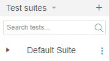
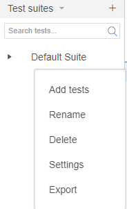
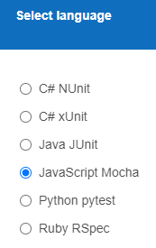

# SeleniumE2E

The easiest way to write E2E tests is to use [Selenium IDE](https://www.selenium.dev/selenium-ide/) where one can interactively create tests.

Once tests/suite is created one can save it (ctrl+S) as `.side` file (for later editing of tests) or export for `JavaScript Mocha`.



and placing them in `e2e` folder

It is necessary to patch the options to make them work, because of the bug in [chrome/selenium](https://bugs.chromium.org/p/chromedriver/issues/detail?id=4403#c35):

```sh
npm run patch
```


